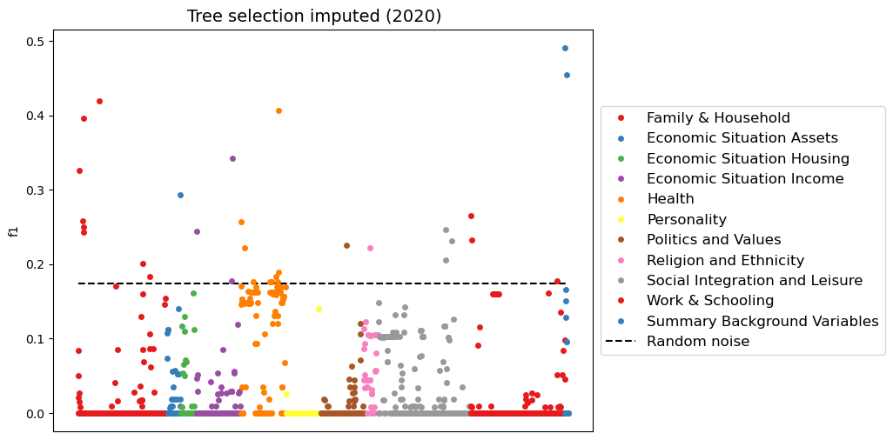
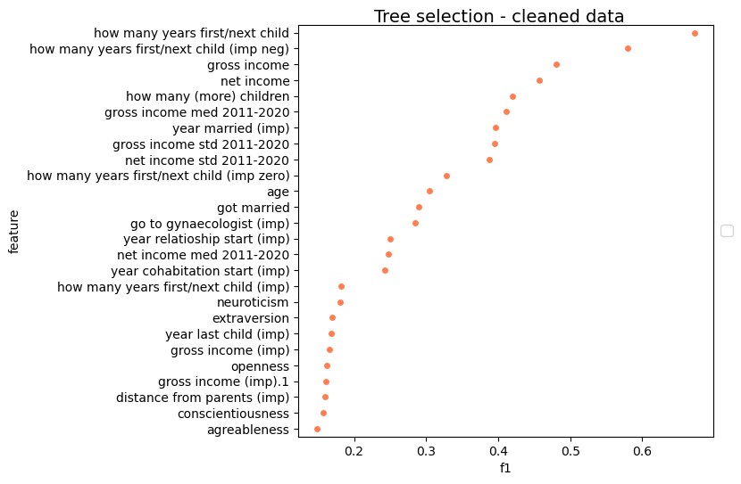
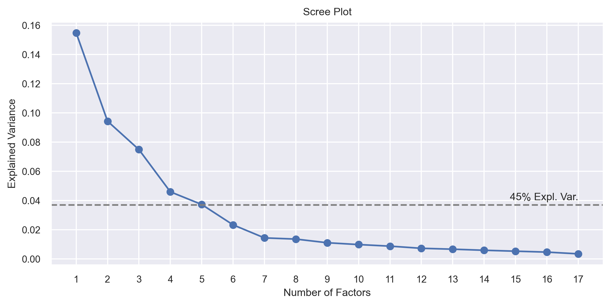
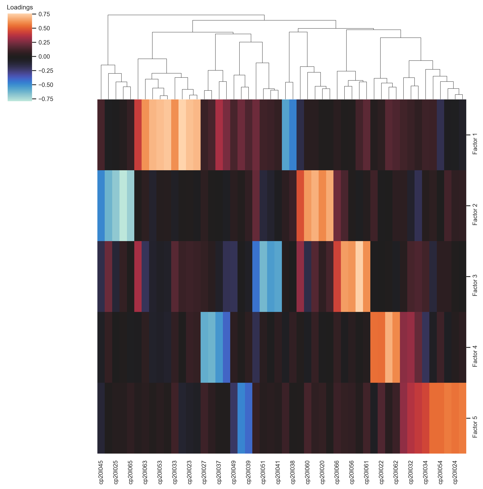

# PreFer data challenge: competition report

The task for PreFer is to predict whether individuals aged 18-45 in 2020 will have a child between 2021 and 2023 based on data collected up to and including 2020. This challenge aims to evaluate the current accuracy of predicting fertility at an individual level and to enhance our understanding of fertility patterns.

The LISS panel, initiated in 2007, consists of a probabilistic sample drawn from the Dutch population register by Statistics Netherlands and managed by Centerdata, a non-profit research institute. It originally included about 5000 households and 8000 individuals aged 16 and older. Panel members participate in ten longitudinal surveys (Core Study modules) covering various topics such as family, health, religion, social integration, work and education, personality, politics and values, assets, income, and housing. These surveys are mostly conducted annually, with some biannually, and consistently measure the same set of variables.

Additional data on the LISS panel comes from the Background survey, completed by a household’s contact person upon joining the panel and updated monthly. This survey gathers fundamental socio-demographic details about all household members, including those not actively participating in the Core surveys.

The primary training dataset comprises individuals aged 18-45 in 2020 who participated in at least one Core survey between 2007 and 2020. Initially totaling approximately 6900 people, many have since exited the LISS panel by 2021-2023. Consequently, data on whether these individuals had a child between 2021 and 2023 is available for only about 1400 of them.

## Initial considerations

Approaching this prediction task, the first thing that came to our mind was this basic principle: even though the datasets are curated and prepared for this competition, the panel wasn't conceived with the intent of predicting individual fertility.
This led to three main hypothesis regarding the features.
- It is very likely that for predicting fertility during 2021-2023, the most important information will come from surveys conducted around 2021, and similarly, features from ten or more years prior will probably be weak in terms of predictive capability. If this is confirmed, it might be beneficial to primarily use the information from surveys conducted in recent years, supplementing it with relevant information from previous years.
- Despite having hundreds of survey questions for each topic, the most important information will probably lie in a few features, and some survey topics might not be useful for prediction. Therefore, it will be crucial to understand which features to select to best utilize the information in the important variables, thereby reducing the data to the most relevant subset.
- We also expect that handling missing values will be relevant to our task: it's possible that those missing values are not caused by a purely random component but may, in some cases, contain information relevant to the study. Given that the data consists of survey questions and responses, some answers may be missing due to the branching nature of questions during the survey completion process, where some questions appear only if the respondent has answered a previous question in a certain way. For example, questions regarding existing children will be missing if the respondent has not had any children yet.
Furthermore, considering that the data comes from a longitudinal survey with yearly surveys, it is possible that missing information for some variables in a given year can be correctly and consistently obtained from previous years (if it makes sense to do so).

On top of these simple considerations, it's worth to add that we can expect very few features to be the most important predictors: indeed, we pondered that it just takes common sense to see that the main predictors of fertility should be age, relationship status and stability, household economic situation, and whether there are already children in the household. Nonetheless, thanks to the vastity of data at hand it will still be possible to identify non-obvious and intriguing relationships. 

All of our considerations will need to be confirmed or refused through appropriate verifications, which will be the first step addressed in our analysis.

## Data exploration

The problem is a classification task and the final model will have to predict if a person will have a child within the following three years (2021-2023) based on the data including 2020. The initial dataset has 6,418 rows and 31,634 columns. 
Before starting our analysis we removed the rows where the outcome is not available and the columns which had all values missing to obtain a initial train set with 987 rows and 25,868 columns.

In addition to the primary dataset, we also utilized the background dataset, which is structured in a longitudinal format. Each subject's answers repeat across multiple rows, corresponding to the different years in which each question was posed. To align it with the main dataset, we filtered subjects with available outcomes, following the same approach used with the primary dataset. It's relevant to note that the background dataset contains information that we logically assumed to be the most important for predicting the likelihood of having a child (e.g. age, income, civil status).

### Tree selection

We decided to focus on the train set first and only afterwards on the background survey.
Our initial aim was to craft a procedure which could test our initial hypothesis. The idea was to develop a quick and automatic way to assess with sustainable precision the marginal predictive power of every feature available. We decided to evaluate the predictive performance on the task of predicting ferility of a univariate model, using a stratified cross-validation with 5 folds and iterating over every feature available. The chosem model for this procedure was a decision tree, for several reasons: it can gracefully handle missing data, it's better suited with categorical/ordinal features stored as numbers that a linear method like logistic regression, and, last but not least, the optimized implementations available (together with the modest number of rows) allowed us to iterate across tens of thousands of features fairly quickly. The results are summarized below.


The first plot show the values of the f1 metric for each feature available, ordered by year of the survey. The black dotted line on the plot represents the f1 score of a randomly generated predictor variable, which serves as a ballpark baseline to evaluate the predictive power of our features. From the image we can clearly see that the preformance metric decreases over time, thereby validating our initial hypothesis regarding the higher relevance of surveys from recent years.


Encouraged by this confirmation, we further explored the variables from the last year, 2020, using the univariate tree method. As observed in the graph below, except for the "Family & Household" survey, most surveys show only few features with notable predictive power. This confirms our earlier assumption that amongst the many feature available only few will be actually relevant for prediction.
The table below shows the most significant variables:

|       | feature        |   accuracy |   precision |   recall |   f1 | var_label                                                                   | survey                       |   year |
|-------|----------------|------------|-------------|----------|------|-----------------------------------------------------------------------------|------------------------------|--------|
|       | cf20m130       |       0.88 |        0.79 |     0.59 | 0.67 | Within how many years do you hope to have your [first/next] child?          | Family & Household           |   2020 |
|  | brutohh_f_2020 |       0.79 |        0.53 |     0.45 | 0.48 | Gross household income in Euros                                             | Summary Background Variables |   2020 |
|  | nettohh_f_2020 |       0.8  |        0.57 |     0.39 | 0.46 | Net household income in Euros                                               | Summary Background Variables |   2020 |
|    | cf20m129       |       0.83 |        0.77 |     0.29 | 0.42 | How many [more] children do you think you will have in the future?          | Family & Household           |   2020 |
|  | birthyear_bg   |       0.79 |        0.53 |     0.26 | 0.35 | Year of birth [imputed by PreFer organisers]                                | Summary Background Variables |      0 |
|     | cf20m004       |       0.79 |        0.56 |     0.24 | 0.33 | Preload variable: Age respondent                                            | Family & Household           |   2020 |
|  | age_bg         |       0.79 |        0.5  |     0.23 | 0.31 | Age of the household member on December 2020 [imputed by PreFer organisers] | Summary Background Variables |      0 |
|   | ch20m219       |       0.79 |        0.55 |     0.21 | 0.3  | gynaecologist                                                               | Health                       |   2020 |
|    | cf20m031       |       0.78 |        0.5  |     0.22 | 0.3  | In what year did you marry?                                                 | Family & Household           |   2020 |
|    | cf20m029       |       0.77 |        0.46 |     0.23 | 0.29 | In what year did you start living together with your partner?               | Family & Household           |   2020 |


As can be observed, the most relevant variables seem to be those related to the desire to have a child, as well as income, age and civil status. It's interesting to note that the variable that indicates whether the person goes to the gynaecologist seems to be a good predictor of fertility: it might allow to identify pregnant women. Overall, these variables not only make logical sense but are also partially aligned with our initial assumptions.

### Missing values

Handling missing values is an important issue given the survey-based nature of this analysis. As previously described, missing values may arise deterministically rather than from purely random reasons: in surveys, the absence of a response to a question can result from the branching logic of previous questions based on the respondent's answers (e.g. questions about children when respondent don't have children). 
Furthermore, if a respondent was not involved in the questionnaire for all available years, it is plausible that there will be missing values for all those years in which they did not participate in the questionnaire. To sum up, the dataset has a significant presence of missing values with different origins.

Given that many features had a lot of missing values, we opted for a quick analysis and found out that, for the most important variables according to the procedure described above, the missing values present a correlation with the response. For example, for the variable "Within how many years do you hope to have your [first/next] child", it seems like subjects that don't respond are more likely to not have a child in the future.

| cf20m130   | no child | new child|
|------------|----------|----------|
| False      |    211   |    153   |
| True       |    564   |     59   |

This prompts us to consider a thoughtful approach to imputing missing data, despite acknowledging that even the indication of missing values in some variables may have utility in fertility modeling. 

We developed an imputation strategy which is tailored to the longitudinal nature of survey variables. Beginning from 2020, for each variable containing missing values, we retrospectively examine earlier years for analogous variables asking the same question, imputing with the most recently observed value. Below is an illustrative example that demonstrates this method, displaying the resulting imputed values.

|    | quest2015   | quest2016   | quest2017   | quest2018   | quest2019   | quest2020   | quest2020_imp       |
|----|-------------|-------------|-------------|-------------|-------------|-------------|----------------------|
|    | 4         |     --      | 4           |       --    | 5           | 5         | 5                  |
|    |        --   |     --      | 5           |       3     |        --   |        --   | 3                    |
|    | 2           |     --      |        --   |       --    |         --  |       --    | 2                    |
|    |        --   |     --      |        --   |       --    |         --  |       --    |          --          |

To examine wheter this approach was successful in improving the predictive power of our features, we conducted the tree selection procedure again on the newly imputed variables. The results are shown below:



We can crearly see that this approach enhances the preditive power of many features, as many variables with low score in the previous tree selection plot appear to be relevant now. Despite that, we note that the variable with the highest score in the previous examination (cf20m130, "Within how many years do you hope to have your [first/next] child") has a much lower score now: this confirms our consideration that missing values contain relevant information and might actually be useful for prediction.

### Background data

Following our exploration of the training data, we turned our attention to the background data. After applying filters to retain the same subjects from the train data, we decided to leverage this background data to calculate aggregated measures over the recent years (2016-2020) for those key features that were repeatedly asked or recorded in both the training data and background data, but were found to be cleaner and more reliable in the latter.

In particular, in addition to extracting information on gender, age, family, domestic, work situation and current marital status, we focused on engineering new features that could summarise changes over time. Specifically, we created a flag to indicate if the subject got married during the 2016-2020 period and introduced indices to measure the median and standard deviation of income across those years.
At the end of this process, we obtained a background dataset with 986 observations and 19 variables. We then applied the previously described tree methods to evaluate the predictive capacity of these variables. The results showed that the variables with good performance included those we created regarding income and marital status changes, as well as age.

## Cleaning and Preprocessing

### Submission History

The explorations reported above were part of an iterative process spanning the entire duration of the competition. These determined the preprocessing procedure utilized for crafting the final model, but were not taken into consideration for the early submissions. We provide few details into the first two submissions before diving deep into the details of our final solution.

**Submission 1**
- Initially, we built a baseline logistic model using a few variables as suggested by the competition guides. We then upgraded to a more powerful classifier, a random forest, utilizing the same features, and observed an improvement in performance, likely due to the model's greater flexibility.
- Next, we focused on the background dataset and developed our preprocessing strategy, creating new features that moved us beyond the baseline according to our internal evaluation. To further enhance the predictive capabilities, we explored the use of a stochastic gradient boosting classifier (implemented using the CatBoost library).
- To incorporate information from the questionnaires not directly related to an individual's background, we investigated questions about children in general. By selecting a sample of these questions, we observed a significant improvement in internal predictive performance. This led to our first submission, which performed well on the test dataset, achieving an F1 score of 0.69 on the leaderboard.

**Submission 2:**
- For the second submission, we began by developing our tree selection procedure to understand the predictive power of each feature. By analyzing the results, we identified several relevant questions that could enhance our model's performance.
- Next, we compared different models using this new dataset, including combinations such as voting and stacking. Based on our internal evaluations, we chose a stacking combination of CatBoost and random forest for the second submission. This model achieved an F1 score of 0.70 on the leaderboard test dataset.

The results from the second submission were worse than anticipated. Up to that point, we had internally evaluated the models using a 5-fold stratified cross-validation, which showed to be a bit too optimistic. We then decided to use a stratified shuffle split procedure with a validation set proportion of 30% and ten repetitions, finding that the internal scores aligned more closely with those on the test set.

### Final preprocessing

Based on our exploratory analysis of the features' predictive power and handling of missing data, our final cleaned dataset comprises selected features from the year 2020, presented in two forms: raw and imputed. However, not all variables underwent imputation. For example, questions such as "Do you visit the gynecologist?" lose their contextual relevance when imputed, transforming into a generic "Have you ever visited the gynecologist?" rather than addressing current pregnancy-related visits. Therefore, for such questions, only the raw data from 2020 was used in the model.

Our technique for imputing missing values involves searching previous years for a response from the same subject to the specific question. For instance, if a user answered the question in 2017, that response was used to fill the missing value for 2020.

We introduced a slight variation in the imputation approach for the variable cf20m130, which asks "In how many years do you want to have your first/next child?". This feature is the strongest predictor in our analysis, and the standard imputation method would introduce bias: for example, if in 2017 the response to "In how many years do you want to have a child?" was 3 years, directly imputing this value for 2020 fails to account for the elapsed time, leading to inaccuracies. To address this, we subtracted k from a response given k years before 2020. For instance, if the answer in 2015 was "10 years," the imputed value for 2020 would be "5 years" (10 - (2020 - 2015)). This approach better reflects the passage of time, although it can result in negative numbers in some situations. We used two versions of this newly imputed feature: one retaining negative values and the other setting negative values to zero.

We also engineered new features using the data present in the training dataset. Specifically, utilizing "year of birth of the i-th child", we created additional variables related to respondents' family demographics, such as the number of children and the birth year of the youngest child. Additionally, we created the variable "same_sex", identifying same-sex relationships (of the 32 instances found, only one individual reported a child born between 2021 and 2023).

The final group of variables introduced were derived from personality surveys. The questions from this survey were leveraged through factor analysis to derive scores for each individual across the five components of personality according to the Big Five model (refer to the appendix for a detailed explanation of the methodology followed).

The background data was processed as described in the data exploration section.

In conclusion, the variables we used for the modeling phase are the following:

- **Imputed features**:
  - 'cf20m005' - Year of birth father
  - 'cf20m008' - When did yout father pass away
  - 'cf20m009' - Year of birth mum 
  - 'cf20m012' - When did yuor mum pass away
  - 'cf20m014' - How old were you when your parents separated
  - 'cf20m398' - Distance from parents
  - 'cf20m028' - Relationship start year
  - 'cf20m029' - Living together start year
  - 'cf20m031' - In what year did you marry
  - 'cf20m185' - Partner disagreement frequency
  - 'cf20m186' - Relationship issues due to working too much
  - 'cf20m250' - Childcare usage
  - 'cf20m251' - Childcare monthly expense
  - 'cf20m471' - Children passed away
  - 'cf20m472' - What age Children passed away
  - 'cf20m486' - Household chores division
  - 'cv20l068' - Political views
  - 'cv20l103' - Overall satisfaction
  - 'cv20l125' - Marriage and children
  - 'cv20l126' - One parent vs two
  - 'cv20l130' - Divorce normalcy
  - 'cs20m180' - Leisure time hours
  - 'cs20m370' - Education level
  - 'cr20m041' - Religiosity
  - 'cr20m093' - Speaking Dutch with partner
  - 'cr20m094' - Speaking Dutch with children
  - 'ca20g023' - car value
  - 'cd20m024' - property value 2020
  - 'ci20m043' - Work situation
  - 'ci20m309' - Paying for children's expenses

- **Imputed and not imputed features**:
  - 'cf20m130' - within how many years do you hope to have your first child
  - 'cf20m129' - How many more children
  - 'cf20m128' - Do you want another child ?
  - 'cf20m025' - Living with partner
  - 'cf20m030' - Are you maried
  - 'cf20m402' - Same partner
  - 'cf20m166' - How satisfied with situation as single
  - 'ch20m219' - gynaecologist
  - 'belbezig_2020' - occupation
  - 'brutoink_f_2020' - gross income
  - 'nettoink_f_2020' -net income
  - 'burgstat_2020' - civil status
  - 'oplcat_2020' - education
  - 'partner_2020' - lives with partner
  - 'sted_2020' - urban type
  - 'woning_2020' - dwelling type
  - 'woonvorm_2020' - domestic situation

- **Features engineered from background data**:
  - 'actual_household_gross_monthly_income_qt'
  - 'actual_household_net_monthly_income_qt'
  - 'actual_household_gross_monthly_income_med_qt'
  - 'actual_household_gross_monthly_income_std_qt'
  - 'actual_household_net_monthly_income_std_qt'
  - 'age_qt'
  - 'gender_ds'
  - 'got_married_fl'
  - 'actual_household_net_monthly_income_med_qt'

- **Not imputed features**:
  - 'migration_background_bg' - Migration background

- **Imputed variations cf20m130 feature**:
  - 'cf20m130_zero'
  - 'cf20m130_negative'

- **Engineered features**:
  - 'year_last_child_imputed'
  - 'num_children_imputed'
  - 'same_sex_ds'

- **Personality features** (refer to the appendix for more details):
  - 'personality_1' - neuroticism
  - 'personality_2' - extraversion
  - 'personality_3' - agreableness
  - 'personality_4' - conscientiousness
  - 'personality_5' - openness


### Exploratory data analysis

After obtaining the preprocessed dataset, we followed with a quick exploration of the final features. Considered that most of them are numerical, we started with an exploration of the correlations. 


From the heatmap we can clearly see that most features are uncorrelated, with the exception of some income variables and their imputed counterparts which show high correlation. This may happen when the number of missing values in a feature is low, causing a high correlation between the imputated version and the raw one. However, by leveraging tree techniques during the modeling phase one might easily overcome this problem.

Following this initial exploration, we show the most important features in the final cleaned dataset, addressed through the tree evaluation procedure already exploited.



As expected, we note that questions about the propensity to have a child are the most important, in the original versions as well as the imputated ones. Other relevant features bring information on income and relationship status. 
We should note here that the Big Five personality traits (neuroticism, extraversion, openness, conscientiousness and agreeableness) seem to have a non negligible predictive power.

Lastly, we present some exploratory representations of the most important variables. 


In the top row, starting from left to right, we first see the distribution of the feature "in how many years do you want to have a child?" across the two groups identified by the target variable. For individuals who will have a child, the responses are concentrated around zero or a few years from 2020. 
Next, the plot representing the question "do you want to have a child in the future?" shows that those who express a desire to have a child have a higher proportion of new children, while those who respond negatively are almost entirely unlikely to have a child. 
The last plot in the top row displays the years of cohabitation, revealing that if cohabitation started recently, there is a larger population of individuals with children.

In the second row, from the left, we observe that individuals with a new child have a higher density of people in their thirties. 
The center plot shows marital status, indicating that the population of those who will have a child is mostly concentrated among those who are married, followed by those who have never been married. 
Finally, the plot for income does not show a clear difference between those who will have a child and those who will not.

## Modeling

After finalizing our preprocessed training set, we compared several modeling approaches to identify the optimal model.

For our internal evaluation, we employed a stratified shuffle split method. This approach involves splitting the data into training and validation sets, repeating the process k times (with k=10 and a validation proportion of 0.3). This validation size was chosen to address the observed discrepancy between internal results and external test performance, which was partly due to the small number of validation samples used initially.

We explored various models in our comparison, favoring tree-based approaches due to their capacity to handle complex relationships and correlated features. Based on past submissions, the most reliable models were random forest and stochastic gradient boosting. We also evaluated the random forest in its extra trees variant, which uses random splits. For gradient boosting, we used three different implementations: CatBoost, LightGBM, and XGBoost. Although these implementations are based on the same underlying model, their different estimation methods can produce notably different results.

For these top candidates (forests and boosting), we designed a hyperparameter tuning procedure using a Bayesian approach. After initial runs, we also considered combining the best models, specifically CatBoost, LightGBM, and extra trees, using both stacking and voting methods. For the voting combination, we found that giving a higher weight (0.5) to CatBoost, since it was the best-performing model, provided the best results.

Below is the final table with the metrics for each model considered in our internal evaluation.

|    | model                |   accuracy |   precision |   recall |       f1 |
|----|----------------------|------------|-------------|----------|----------|
|  0 | voting_s             |   0.912795 |    0.857656 | 0.715625 | 0.779128 |
|  1 | voting_h             |   0.914815 |    0.88257  | 0.698438 | 0.778877 |
|  2 | catb                 |   0.914141 |    0.876642 | 0.701562 | 0.778365 |
|  3 | stacking lgb-catb    |   0.90202  |    0.785038 | 0.753125 | 0.767877 |
|  4 | stacking et-catb-lgb |   0.899327 |    0.768347 | 0.765625 | 0.766037 |
|  5 | stacking et-catb     |   0.89798  |    0.759823 | 0.771875 | 0.765082 |
|  6 | lgb                  |   0.903367 |    0.815643 | 0.714063 | 0.760623 |
|  7 | et                   |   0.908418 |    0.875146 | 0.671875 | 0.759467 |
|  8 | xgb                  |   0.898653 |    0.813442 | 0.689063 | 0.745155 |
|  9 | rf                   |   0.890572 |    0.81559  | 0.6375   | 0.714382 |
| 10 | svc                  |   0.876431 |    0.857157 | 0.5125   | 0.639506 |
| 11 | dt                   |   0.840067 |    0.628482 | 0.6375   | 0.631402 |
| 12 | mlp                  |   0.845791 |    0.661137 | 0.603125 | 0.628453 |
| 13 | lr                   |   0.785522 |    0.502456 | 0.726562 | 0.593172 |
| 14 | knn                  |   0.849495 |    0.789623 | 0.417187 | 0.542875 |

In conclusion, the final model proposed is a weighted voting combination of CatBoost, LightGBM, and extra trees, with CatBoost given a higher weight (0.5) due to its superior performance. Notably, the best standalone model, CatBoost, performs closely to the combined model, emphasizing its reliability.

### Shap values

After fitting our final model, we concentrated on explaining feature contributions by calculating the Shapley values for the CatBoost model, which serves as the primary estimator in our voting ensemble. Shapley values are a state-of-the-art, model-agnostic method for interpreting and explaining features in both tabular and unstructured data. In our case, they provide a more effective assessment of the global relevance of predictors in tree models compared to traditional feature importances, and they also enable a deeper investigation into the impacts of individual variables.


Based on the mean absolute SHAP values, we can identify two main groups of strong predictors:
- intention of having a child: the feature "will have (more) children (imp)" is by far the strongest predictor. Along with other related features such as "how many (more) children," "how many years first/next child," and various imputation variants, it forms a group comprising seven of the ten most important predictors.
- relationship status: the second most important predictor is the start year of cohabitation started. Other significant features include the civil status and a custom-made flag indicating whether the subject got married between 2016 and 2020.

In addition to these strong predictors, age emerges as the third most important feature. Notably, the model also benefits from the variable "go to the gynecologist," which might help identify women who were pregnant in 2020. Lastly, two personality traits from the Big Five model, agreeableness and conscientiousness, are among the top twenty predictors. This suggests that an individual's personality, as modeled through the Big Five, could be a useful additional predictor of fertility.

We now explore the univariate shap values for some of the top predictors.


In the top-left plot, we observe that individuals who express a desire to have a child exhibit much higher SHAP values (indicating a stronger marginal effect on prediction) than those who don't want a child or are unsure. This is unsurprising, and the pattern appears more pronounced for older subjects. Moving from left to right, we see a higher predicted probability of the event for people in their thirties who declared an intention to have another child within the next three years. The final plot in the top row shows that married individuals generally have a higher predicted probability of having a child, especially those who marry young.

In the second row, we observe that SHAP values are higher for individuals who started cohabiting with their partner recently (or at least within ten years prior to 2020) and are aged 28-38. The last plot on the right indicates that those who visit a gynecologist have a significantly higher expected probability than those who don't, supporting our hypothesis that this variable might help identify pregnant women.

## Final considerations

We sum up our main findings and results below:
- We are able to successfully address this prediction task, as our final model reaches an accuracy of around 90%. We noted that sophisticated prediction tecniques might give a small edge on performance metrics but are not a hard requirement for predictiong this phenomenon.
- We are not able to provide new particular insights regarding the relevant predictors of fertility, given that the most important features emerged are the intention of having a child and the relationship status of the couple, as one could have imagined beforehand. Despite that, we showed how information on the individual personality, as introduced here using factor analysis, might be useful in enhancing predictions. 
- In a new dataset, not having the information on the intention of having a child would surely hinder the model capabilities. Nonetheless, having a bigger dataset would open new possibilities of handling missing values for key information.

## Appendix

### Big Five

To address the personality component and understand whether certain personality traits could influence the propensity to have another child, we decided to focus on the Personality survey. We thought we could leverage existing psychometric models, such as those described by Costa, Paul T., and Robert R. McCrae in "A five-factor theory of personality" (The five-factor model of personality: Theoretical perspectives 2, 1999: 51-87) which has been widely used: The Big 5 Model.

The Big Five Personality Traits, or the "Five Factor Model" (FFM), represent a widely accepted psychological framework identifying five core dimensions of personality: Extraversion, Agreeableness, Conscientiousness, Emotional Stability, and Openness to Experience.
Unlike other trait theories that sort individuals into binary categories (i.e., introvert or extrovert), the Big Five Model asserts that each personality trait is a spectrum. Therefore, individuals are ranked on a scale between the two extreme ends of five broad dimensions. By ranking individuals on each of these traits, it is possible to effectively measure individual differences in personality.

These traits were uncovered through empirical research employing factor analysis on extensive datasets from psychometric questionnaires. Researchers administered a range of questions probing behaviors, preferences, attitudes, and cognitive styles. Factor analysis revealed patterns of correlated questions, forming the basis of the five personality dimensions.
These dimensions have been rigorously validated across diverse cultures and contexts, cementing their status as a primary model for comprehending human personality. The Big Five Personality Traits are prominent due to their wide applicability, reliability, and practical relevance across various fields.

#### Preprocessing and computation
We decided to apply this type of analysis using the personality survey section. Specifically, we utilized the part of the questionnaire that begins with the statement "How accurately do the statements below describe you (as a person)?" with responses categorized on a 5-point scale ranging from 1 (very inaccurate) to 5 (very accurate). These questions correspond to variables cp___29 to cp___69 in the personality survey, with the central part of the code changing depending on the year the survey was conducted.

The idea behind using these 40 survey variables is to condense the personality information of the sample population into a smaller number of variables. We used all subjects in the sample, including those with unavailable outcomes, and selected all survey variables from the last year of survey administration. To address missing values, we imputed values using information from the previous year with the method previously described. This choice is based on the idea that personality traits remain relatively stable over a short period of years, making this method coherent. The few remaining missing values were imputed with the mean for each variable. Subsequently, a factor analysis was applied to these variables.

In the factor analysis (FA), we employed an Oblimin Rotation method. This approach enables the selected factors to be correlated with one another. In contrast to orthogonal rotations, such as Varimax, which impose uncorrelated factors, Oblimin permits correlations between factors. The objective is to obtain a more interpretable factor structure while accommodating inter-factor relationships, thereby providing a more nuanced understanding of the underlying personality traits.

#### Results
In order to asses the pertinence of the Big Five model, it is essential to determine the optimal number of factors to retain. To do this, we examined the explained variance contributed by each factor using a scree plot.



Above is a scree plot, which displays the variance explained by each factor. As can be seen, there is an elbow around 5 and 6. Based on our knowledge of the Big Five personality traits and the presence of an elbow corresponding to 5, it is reasonable to opt for the use of 5 components. Furthermore, with 5 factors, we achieve a cumulative explained variance of 45%, a substantial percentage that confirms the soundness of our choice.

Having chosen 5 factors for the analysis, we obtained the loadings in order to interpret the factors and attempted to verify whether they correspond to the five well-established personality traits known in the literature.
In the following heat map, we display the loading values for each factor corresponding to each variable. We employed hierarchical clustering to group variables based on their correlation with each factor, thereby better illustrating the presence of clusters of survey questions that characterize each factor.



Indeed, from the graph, it is apparent that there are clusters of variables that exhibit a high correlation with only one factor. Additionally, it is observed that for each factor, there are groups of variables with positive correlations, indicating a direct relationship between the subjects' responses and the factor, and others with negative correlations, suggesting an inverse relationship.

We therefore aim to interpret the latent factors found by specifically investigating the questions posed regarding personality and their correlation with these factors.

We examine the 8 most relevant questions by looking at the highest absolute loading values for each factor. In the table below, one can observe the top 8 variables for each factor and the positive (+) or negative (-) relationship with the individual factors.

|    | Neuroticism                      | Extraversion                                      | Agreeableness                                     | Conscientiousness                                          | Openness                                          |
|----|----------------------------------|---------------------------------------------------|---------------------------------------------------|------------------------------------------------------------|---------------------------------------------------|
|    | (+) Get upset easily.            | (-) Keep in the background.                       | (+) Sympathize with others’ feelings.             | (+) Like order.                                            | (+) Have excellent ideas.                         |
|    | (+) Have frequent mood swings.   | (-) Am quiet around strangers.                    | (-) Am not really interested in others.           | (-) Often forget to put things back in their proper place. | (+) Am full of ideas.                             |
|    | (+) Get stressed out easily.     | (-) Don’t talk a lot.                             | (+) Am interested in people.                      | (-) Leave my belongings around.                            | (+) Have a rich vocabulary.                       |
|    | (+) Change my mood a lot.        | (+) Start conversations.                          | (+) Take time out for others.                     | (+) Follow a schedule.                                     | (+) Use difficult words.                          |
|    | (+) Am easily disturbed.         | (+) Talk to a lot of different people at parties. | (+) Feel others’ emotions.                        | (+) Get chores done right away.                            | (+) Am quick to understand things.                |
|    | (+) Often feel blue.             | (+) Don’t mind being the center of attention.     | (-) Am not interested in other people’s problems. | (+) Am always prepared.                                    | (-) Have difficulty understanding abstract ideas. |
|    | (+) Get irritated easily.        | (-) Don’t like to draw attention to myself.       | (-) Feel little concern for others.               | (-) Make a mess of things.                                 | (+) Have a vivid imagination.                     |
|    | (+) Worry about things.          | (+) Am the life of the party.                     | (+) Make people feel at ease.                     | (-) Shirk my duties.                                       | (-) Am not interested in abstract ideas.          |
|   | (-) Am relaxed most of the time. | (-) Have little to say.                           | (-) Insult people.                                | (+) Pay attention to details.                              | (+) Spend time reflecting on things.              |

From the results, the 5 personality traits known in the literature can be identified.

* **Openness** to experience: creativity, intellectual curiosity, interest in art and culture, openness to new experiences and ideas;
* **Conscientiousness**: reliability, organization, attention to detail, self-control, goal orientation;
* **Extraversion**: sociability, assertiveness, energy, enthusiasm, tendency to seek stimulation and the company of others;
* **Agreeableness**: empathy, altruism, cooperativeness, kindness, propensity to maintain good interpersonal relationships;
* **Neuroticism**: tendency towards anxiety, sadness, emotional vulnerability, emotional instability, greater reactivity to stress.

The most relevant questions for each factor match excellently with the well-known description of each personality trait.
We therefore assume that we have identified the 5 latent factors that describe the personalities, thereby reducing the dimensionality from about 60 variables to 5, which essentially contain a substantial amount of information. Consequently, we choose to use the scores for the 5 dimensions from the factor analysis as covariates in the models we will compare for the prediction task.

### Transfer learning

Following our main attempts, we opted to reassess the problem from a distinct perspective and explore an alternative approach. Our novel strategy involved reframing the problem as a text classification task. Specifically, we converted our cleaned tabular dataset, comprising carefully selected variables, into a string-based representation, where each row was treated as a textual description encapsulating all available information about a given subject. This transformation yielded a format of `Question_1 <question> answer_1 <answer>... Question_n <question> answer_n <answer>` for each text representation.

In order to tackle this reformulated problem, we leveraged a pre-trained language model, namely a distilled version of BERT (DistilBert). We employed transfer learning to fine-tune the model on our specific task, capitalizing on the knowledge it had acquired during its pre-training phase. The pre-trained language model was accessed using the HuggingFace transformers package, and we utilized Google Colab's GPU capabilities to facilitate the computationally intensive process of transfer learning.
We designed a model that utilizes the pre-trained DistilBERT for extracting meaningful numeric representations from input text, and added a final forward layer to adapt to our binary classification task. In accordance with the principles of transfer learning, we froze the parameters of the feature extractor (i.e. they were not updated during training) and trained for few epochs to learn the final classifier weights.

The final model, evaluated on a holdout set, demonstrated a predictive performance comparable to that of the weakest models explored in the classic tabular approach. This outcome indicates that the transfer learning was conducted effectively, successfully leveraging the pre-trained language model as a feature extractor and learning the weights of the final classifier to predict for our task. 

While there is much room for improvement, we considered this approach as a proof-of-concept rather than a submission attempt. A thorough assessment of this approach would require exploring different base models, classifier architectures, text representations and training configurations (e.g., epochs, batch size, optimizers, learning rate).

Here is the complete code:

```python
import pandas as pd
import torch
import torch.nn as nn
from transformers import (
    AlbertModel,
    AlbertConfig,
    AutoTokenizer,
    AutoModel,
    DistilBertModel,
    AdamW
)
from sklearn.model_selection import StratifiedKFold, train_test_split
from sklearn.metrics import accuracy_score, precision_score, recall_score, f1_score
from torch.utils.data import DataLoader, Dataset
from tqdm import tqdm

# X = ...
# y = ...

# define custom Dataset class
class TabularDataset(torch.utils.data.Dataset):
    def __init__(self, X, y, tokenizer, max_length):
        self.X = X
        self.y = y
        self.tokenizer = tokenizer
        self.max_length = max_length
        self.column_names = X.columns.tolist()

    def __len__(self):
        return len(self.X)

    def __getitem__(self, idx):
        text = " ".join([f"Question_{i} <<<{name}>>> answer_{i} <<<{value}>>>" for i, (name, value) in enumerate(zip(self.column_names, self.X.iloc[idx]))])
        labels = self.y.iloc[idx]

        encoding = self.tokenizer(text, max_length=self.max_length, padding="max_length", truncation=True, return_tensors="pt")

        return {
            "input_ids": encoding["input_ids"].flatten(),
            "attention_mask": encoding["attention_mask"].flatten(),
            "labels": torch.tensor(labels, dtype=torch.long),
        }

# prepare model
model_name = "distilbert-base-uncased"
tokenizer = AutoTokenizer.from_pretrained(model_name)
device = torch.device("cuda")

# custom DistilBERT model
class DistilBERTClass(torch.nn.Module):
    def __init__(self):
        super(DistilBERTClass, self).__init__()
        self.l1 = DistilBertModel.from_pretrained("distilbert-base-uncased")
        self.classifier = torch.nn.Linear(768, 2) 

    def forward(self, input_ids, attention_mask=None):
        output_1 = self.l1(input_ids=input_ids, attention_mask=attention_mask)
        hidden_state = output_1[0]
        pooler = hidden_state[:, 0]
        output = self.classifier(pooler)
        return output

model = DistilBERTClass().to(device)

# freeze the pre-trained layers
for param in model.l1.parameters():
    param.requires_grad = False

# training parameters
criterion = torch.nn.CrossEntropyLoss()
optimizer = torch.optim.Adam(model.parameters(), lr=1e-5)
scheduler = torch.optim.lr_scheduler.StepLR(optimizer, step_size=5, gamma=0.1)

# prepare data
X_train, X_test, y_train, y_test = train_test_split(X, y, test_size=0.3, random_state=42)

dataset_train = TabularDataset(X_train, y_train, tokenizer, max_length=128)
data_loader_train = DataLoader(dataset_train, batch_size=32, shuffle=True)

dataset_test = TabularDataset(X_test, y_test, tokenizer, max_length=128)
data_loader_test = DataLoader(dataset_test, batch_size=32, shuffle=False)

data_loader = {'train': data_loader_train, 'val': data_loader_test}


def train(model, device, data_loader, criterion, optimizer, scheduler):
    model.train()
    total_loss = 0
    total_correct = 0
    total_samples = 0

    for batch in tqdm(data_loader['train']):
        input_ids = batch["input_ids"].to(device)
        labels = batch["labels"].to(device)
        attention_mask = batch["attention_mask"].to(device)

        logits = model(input_ids, attention_mask=attention_mask)
        loss = criterion(logits, labels)
        _, preds = torch.max(logits, 1)

        total_loss += loss.item()
        total_correct += torch.sum(preds == labels).item()
        total_samples += labels.size(0)

        loss.backward()
        optimizer.step()
        optimizer.zero_grad()

    scheduler.step()
    return total_loss / len(data_loader['train']), total_correct / total_samples

def evaluate(model, device, data_loader):
    model.eval()
    total_loss = 0
    total_correct = 0
    total_samples = 0

    with torch.no_grad():
        for batch in data_loader['val']:
            input_ids = batch["input_ids"].to(device)
            labels = batch["labels"].to(device)
            attention_mask = batch["attention_mask"].to(device)

            logits = model(input_ids, attention_mask=attention_mask)
            loss = criterion(logits, labels)
            _, preds = torch.max(logits, 1)

            total_loss += loss.item()
            total_correct += torch.sum(preds == labels).item()
            total_samples += labels.size(0)

    return total_loss / len(data_loader['val']), total_correct / total_samples

# training loop
num_epochs = 20
device = torch.device('cuda' if torch.cuda.is_available() else 'cpu')

for epoch in range(num_epochs):
    print(f'Epoch {epoch+1}/{num_epochs}')
    
    # train for one epoch
    train_loss, train_acc = train(model, device, data_loader, criterion, optimizer, scheduler)
    print(f'\ttrain loss: {train_loss:.4f}, train acc: {train_acc:.4f}')
    
    # evaluate on validation set
    val_loss, val_acc = evaluate(model, device, data_loader)
    print(f'\tval loss: {val_loss:.4f}, val acc: {val_acc:.4f}')
```
