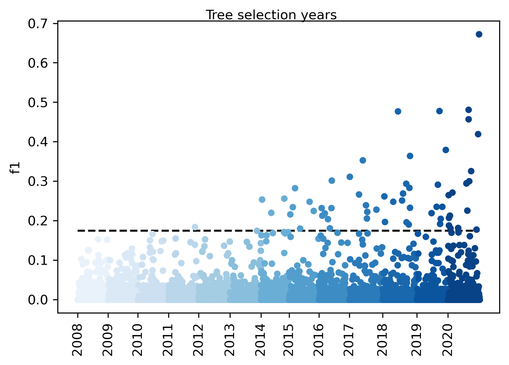
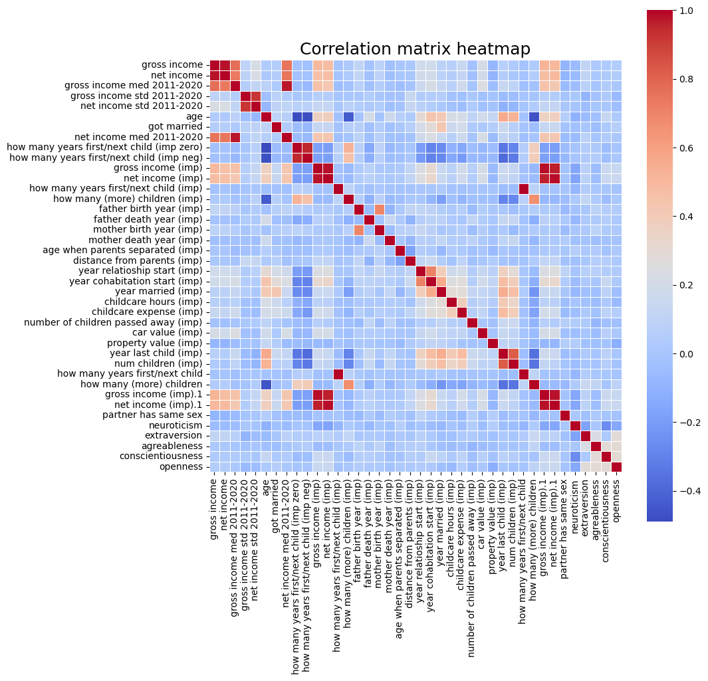
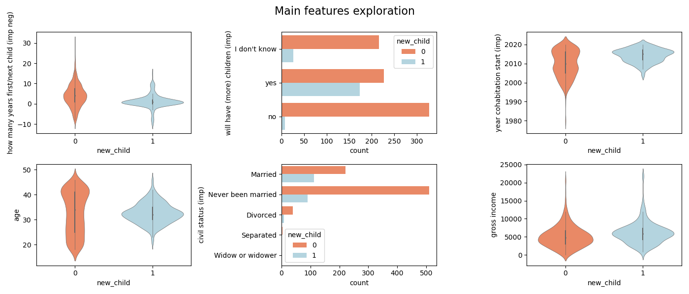
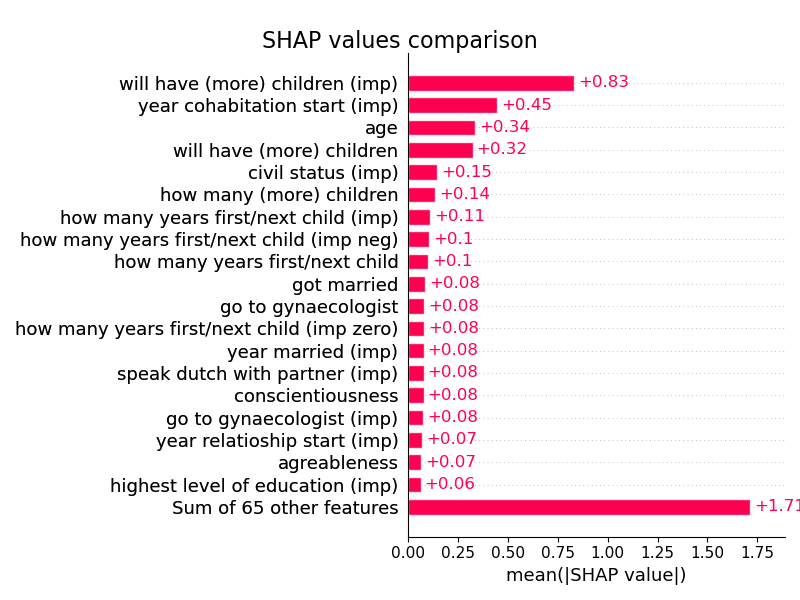
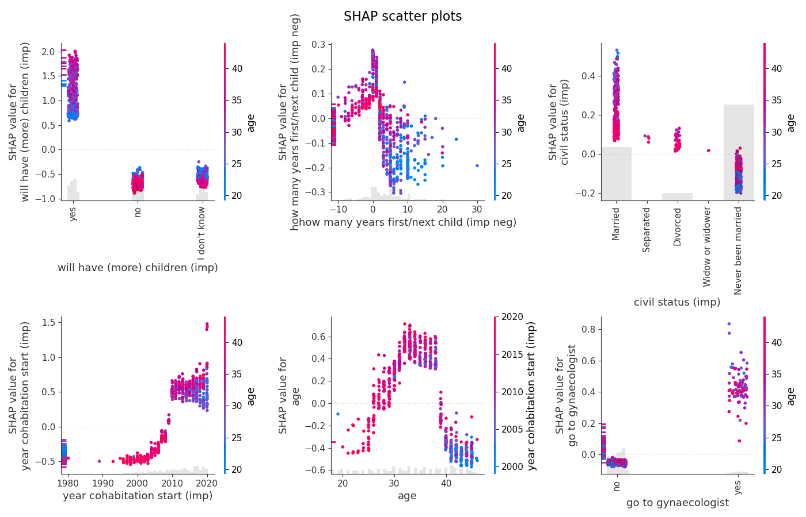

# First slide :)

---

# Initial considerations

- **Recent Data Priority**: Key insights for predicting fertility (2021-2023) likely stem from surveys around 2021. Older data may have weaker predictive power. Focus on recent surveys, supplemented by relevant past data.
  
- **Feature Selection**: Despite numerous survey questions, only a few features may be crucial. Identifying and selecting these key features is essential to streamline the dataset.

- **Handling Missing Values**: Missing data might not be random and could hold valuable information. Some missing responses result from survey branching logic. Longitudinal data may allow filling gaps with past information.

- **Key Predictors**: Likely predictors include age, relationship status, economic situation, and existing children. However, the dataset's breadth may reveal unexpected patterns.

---

# Data exploration

- **Task Overview**: Classify if a person will have a child within 2021-2023 using 2020 data.
  
- **Dataset Details**: 
  - Initial dataset: 6,418 rows, 31,634 columns.
  - Cleaned dataset: 987 rows, 25,868 columns (removed rows with missing outcomes and columns with all missing values).

- **Background Dataset**: 
  - Longitudinal format with repeated entries per subject across years.
  - Filtered to include subjects with available outcomes.
  - Contains key predictive features (e.g., age, income, civil status).

---

# Tree selection

- Used a univariate decision tree with stratified 5-fold cross-validation for feature evaluation.
- Decision tree chosen for handling missing data and categorical features efficiently.
- Quick iteration over features due to optimized implementations and manageable data size.

- Results show F1 scores by survey year, with a random predictor as a baseline.
- Performance decreases over time, supporting the relevance of recent surveys.

---

## Tree Selection: 2020 Focus

- Further explored 2020 variables using the univariate tree method.

- Most surveys, except "Family & Household," have few features with strong predictive power.
- Confirms that only a few features are crucial for prediction.

---

# Missing values

Hi there!

---

# Submission history

Hi there!

---

# Exploratory data analysis

Hi there!

---

# Exploratory data analysis

Hi there!

---

# Exploratory data analysis

Hi there!

---

# Modeling

Hi there!

---

# Model interpretation

Hi there!

---

# Model interpretation

Hi there!

---

# Final considerations

Hi there!

---

# Appendix: Big five

Hi there!

---

# Appendix: Big five

Hi there!

